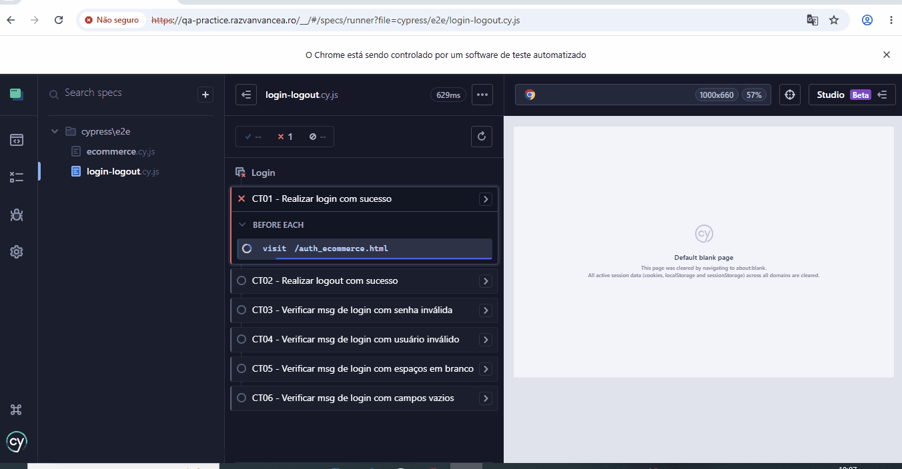

# 🧪 Projeto de Testes Automatizados - QA Practice E-commerce

Este projeto contém uma suíte de **testes automatizados end-to-end (E2E)** para validação dos fluxos de **Login, Logout e Checkout (Compra)** da aplicação **QA Practice E-commerce**.

Os testes foram desenvolvidos utilizando o framework **Cypress**, seguindo boas práticas de automação de testes, incluindo:

- Arquitetura **Page Objects / Actions Pattern**
- Separação de responsabilidades
- Reutilização de métodos
- Organização de massa de dados utilizando Fixtures
- Cenários positivos e negativos
- Validações de regras de negócio

🔗 **Aplicação utilizada para testes:**

https://qa-practice.razvanvancea.ro/auth_ecommerce.html

---

# 🎥 Demonstração da Execução



---

# 🧪 Cenários de Testes Automatizados Cobertos

A suíte contempla validações das funcionalidades de **autenticação, logout e fluxo de compra**, garantindo o comportamento esperado para cenários positivos e negativos.

## 🔐 Login e Logout

| ID | Cenário | Descrição |
|---|---|---|
| **CT01** | Realizar login com sucesso | Valida o acesso ao sistema utilizando credenciais válidas. |
| **CT02** | Realizar logout com sucesso | Verifica se o usuário consegue sair corretamente após autenticação válida. |
| **CT03** | Login com senha inválida | Valida a mensagem de erro ao informar usuário correto e senha incorreta. |
| **CT04** | Login com usuário inválido | Verifica o comportamento do sistema com credenciais inexistentes. |
| **CT05** | Login com espaços em branco | Valida tratamento de entrada contendo apenas espaços nos campos obrigatórios. |
| **CT06** | Login com campos vazios | Verifica mensagens de validação ao tentar enviar o formulário sem preenchimento. |

---

## 🛒 Fluxo de Compra

| ID | Cenário | Descrição |
|---|---|---|
| **CT07** | Realizar compra com sucesso | Valida a conclusão da compra preenchendo todos os campos obrigatórios com dados válidos. |
| **CT08** | Impedir finalização da compra com campos vazios | Verifica se o sistema impede a finalização da compra quando nenhum campo obrigatório é preenchido. |
| **CT09** | Impedir finalização da compra com campo Phone Number vazio | Valida a obrigatoriedade do campo telefone durante o preenchimento dos dados de compra. |
| **CT10** | Impedir finalização da compra com campo Street vazio | Verifica se o sistema apresenta validação ao deixar o endereço (Street) sem preenchimento. |
| **CT11** | Impedir finalização da compra com campo City vazio | Valida a obrigatoriedade do campo cidade para concluir a compra. |
| **CT12** | Impedir finalização da compra com campo Country vazio | Verifica se o sistema impede a conclusão do pedido quando o país não é informado. |

---


---

## 🛠️ Tecnologias Utilizadas

* **[Cypress](https://cypress.io):** Framework de testes ponta a ponta (E2E).
* **JavaScript / Node.js:** Linguagem base e ambiente de execução.
* **Page Objects / Actions Pattern:** Padrão de projeto utilizado para melhor reuso e manutenção do código.

---

## 🚀 Como Executar o Projeto

### Pré-requisitos
* [Node.js](https://nodejs.org) (versão LTS recomendada)
* [Git](https://git-scm.com)

### Passo 1: Instalar as Dependências
```bash
npm install
```

### Passo 2: Executar os Testes

**Para rodar os testes no modo Interativo (Interface Gráfica do Cypress):**
```bash
npx cypress open
```

**Para rodar os testes no modo Headless (Via Linha de Comando no Terminal):**
```bash
npx cypress run
```

---

## 📁 Estrutura do Projeto

```text
cypress
│
├── actions
│   ├── LoginActions.js
│   └── EcommerceActions.js
│
├── e2e
│   └── login-logout.cy.json
│   └── ecommerce.cy.json
│
├── fixtures
│   └── login.json
│   └── ecommerce.json
│
├── pages
│   ├── LoginPage.js
│   └── EcommercePage.js
│
└── docs
    ├── execute-cypress.gif
    └── bdd-cenarios.md
.github/
└── workflows/
    └── ci.yml
```

## 📌 Organização das Pastas

| Pasta | Descrição |
|--------|-----------|
| **actions/** | Contém a camada de ações responsável por implementar os fluxos de negócio dos testes. Essa camada orquestra as interações entre os cenários de teste e os Page Objects, tornando os testes mais legíveis e reutilizáveis. |
| **pages/** | Implementa o padrão **Page Object Model (POM)**, centralizando seletores e métodos de interação com as páginas da aplicação. Isso reduz duplicidade de código e facilita futuras manutenções. |
| **e2e/** | Contém os cenários de testes automatizados organizados por funcionalidade. Cada arquivo representa uma suíte de testes executada pelo Cypress. |
| **fixtures/** | Armazena as massas de dados utilizadas durante a execução dos testes, permitindo separar os dados da lógica de automação e facilitando sua manutenção. |
| **support/** | Reúne configurações globais do Cypress, comandos customizados e inicializações compartilhadas entre todos os testes. |
| **docs/** | Armazena arquivos utilizados na documentação do projeto, BDD e evidências de execução. |
| **.github/workflows/** | Contém o pipeline de Integração Contínua (CI) responsável por executar automaticamente a suíte de testes no GitHub Actions a cada push ou pull request. |